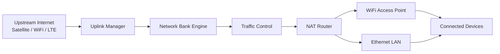

<div align="center">

# ⭐ BankNet — Portable SIM-less ISP Router

**A portable programmable micro-ISP that stores and distributes internet bandwidth.**


</div>

<p align="center">

</p>

<p align="center">


</p>

---

# 🌍 Overview

**BankNet** is a **battery-powered portable router that functions as a micro-ISP**.  
It introduces the concept of **network banking**, where internet bandwidth can be **stored locally and distributed to connected devices** even when upstream connectivity is unstable.

The project demonstrates **edge networking architecture, traffic shaping, and software-defined routing** built on **Node.js and Linux networking tools**.

BankNet is inspired by modern satellite networking systems like **Starlink**, exploring how **portable ISP nodes** could operate in remote or intermittent-connectivity environments.

---

# 🎥 Project Demo

<p align="center">


</p>

**What the demo shows**

• Booting the portable router  
• Connecting to upstream network  
• Banking internet bandwidth  
• Devices connecting to the hotspot  
• Live bandwidth distribution  

---

# ⚙️ Live System Flow



---

# 🧠 Engineering Highlights

This project demonstrates practical skills in:

• Embedded networking systems  
• Linux packet routing and NAT  
• Bandwidth shaping using traffic control  
• REST API design for infrastructure services  
• Edge computing architecture  
• Portable ISP design  

---

# 📊 Repository Metrics

<p align="center">


</p>

---

# 🧩 Core Modules

| Module | Responsibility |
|------|------|
| **Bank Engine** | Stores bandwidth quota |
| **WiFi Manager** | Handles AP and uplink connections |
| **NAT Router** | Routes packets to connected devices |
| **Traffic Controller** | Bandwidth throttling and shaping |
| **Scheduler** | Automatic network bank refilling |
| **API Server** | Router control interface |
| **Web Dashboard** | Monitoring and configuration |

---

# 🔬 Future Research Directions

BankNet can evolve into an advanced **edge networking platform** with:

• decentralized mesh networking  
• peer-to-peer bandwidth exchange  
• satellite edge nodes  
• distributed ISP infrastructure  

---

# ⭐ Support the Project

If you find this project interesting:

⭐ Star the repository  
🍴 Fork the project  
🐛 Submit issues or improvements  

---

# 🖼 Adding the Demo GIF

Place the demo file here:

```
docs/banknet-demo.gif
```

Recommended tools for recording the demo:

• OBS Studio (screen capture)  
• Peek (quick GIF recording)  
• ScreenToGif  

Record:

1. Start router  
2. Open dashboard  
3. Connect device  
4. Show bandwidth changing  

This creates a **powerful visual demo for recruiters**.

---
---

# 🚀 Key Features

## 🌐 Upstream Internet Connectivity

BankNet can obtain internet access through multiple sources:

• Satellite modules (LEO / MEO)  
• Wi-Fi uplink networks  
• Ethernet WAN  
• Future LTE / 5G support  

This allows the router to function in **remote or unstable network environments**.

---

## 🏦 Network Banking

A core concept where internet bandwidth is **stored locally as a usable quota**.

Capabilities:

• Bandwidth quota storage  
• Usage accounting  
• Controlled distribution  
• Network conservation during outages  

This allows **offline-first networking scenarios**.

---

## 📡 Portable Mini-ISP

BankNet acts as a **local ISP node**, distributing internet to nearby devices.

Supported access methods:

• WiFi Access Point  
• Ethernet LAN  

Networking services:

• NAT routing  
• DHCP server  
• device management  
• network isolation  

---

## ⚡ Supply Control

Administrators can **dynamically control bandwidth supply**.

```
1 Mbps → 1000 Mbps
```

Use cases:

• traffic throttling  
• fair device allocation  
• bandwidth preservation  

---

## 🔁 Auto Refill

BankNet automatically reconnects to upstream sources when the **network bank becomes low**.

This allows the router to maintain **continuous availability** even with intermittent connectivity.

---

## 🔌 LAN Refill

Bandwidth can also be **manually injected via Ethernet**.

Useful for:

• offline networks  
• edge nodes  
• disaster recovery environments  

---

## 🔋 Battery Powered

BankNet is designed to operate as a **portable networking device**.

| Battery Capacity | Estimated Runtime |
|-----------------|------------------|
| 10,000 mAh | 4–6 hours |
| 20,000 mAh | 8–12 hours |

---

# 🏗 System Architecture

```
             Upstream Internet
      (Satellite / WiFi / WAN / LTE)
                    │
                    ▼
           ┌───────────────────┐
           │  Uplink Manager   │
           │ Network Connector │
           └─────────┬─────────┘
                     │
                     ▼
           ┌───────────────────┐
           │  Network Bank     │
           │ Bandwidth Storage │
           └─────────┬─────────┘
                     │
                     ▼
           ┌───────────────────┐
           │ Traffic Control   │
           │ Speed Limiting    │
           └─────────┬─────────┘
                     │
                     ▼
           ┌───────────────────┐
           │ NAT Router        │
           │ Packet Forwarding │
           └─────────┬─────────┘
                     │
        ┌────────────┴────────────┐
        ▼                         ▼
  WiFi Access Point         Ethernet LAN
        │                         │
        └────────────┬────────────┘
                     ▼
           Connected Client Devices
         (Phones • Laptops • IoT)
```

---

# 📂 Repository Structure

```
banknet/
│
├── config/                 # YAML configuration files
│
├── src/
│   ├── banking/            # Network bank management
│   ├── wifi/               # WiFi client/AP manager
│   ├── nat/                # NAT routing engine
│   ├── scheduler/          # Auto-refill scheduler
│   ├── api/                # REST API server
│   ├── web/                # Web dashboard UI
│   └── cli/                # Command-line utilities
│
├── docs/                   # Documentation and images
│
├── README.md
├── LICENSE
├── package.json
└── requirements.txt
```

---

# 🧰 Technology Stack

### Core Platform

• Node.js  
• Linux networking tools  
• iptables / nftables  
• Traffic Control (tc)

### Networking

• NAT routing  
• DHCP server  
• WiFi access point  
• bandwidth shaping  

### Optional Tools

• Python CLI utilities

---

# ⚙️ Installation

## 1️⃣ Clone Repository

```bash
git clone https://github.com/mwakidenis/banknet.git
cd banknet
```

---

## 2️⃣ Install Dependencies

```bash
npm install
```

Optional tools:

```bash
pip install -r requirements.txt
```

---

## 3️⃣ Start Router

```bash
npm start
```

---

# 🔧 Configuration

Configuration is handled via:

```
config/config.yaml
```

Example configuration:

```yaml
wifi:
  ssid: BankNet
  password: securepass123

bank:
  capacity: 10000
  refill_threshold: 2000

network:
  max_speed: 200
```

---

# 🌐 REST API

| Endpoint | Method | Description |
|--------|--------|-------------|
| `/api/bank/status` | GET | Get bank status |
| `/api/bank/refill` | POST | Refill network bank |
| `/api/bank/speed` | POST | Set bandwidth supply |
| `/api/wifi/status` | GET | WiFi status |
| `/api/wifi/scan` | POST | Scan networks |
| `/api/nat/start` | POST | Start NAT routing |
| `/api/scheduler/start` | POST | Start auto refill |

---

# 🖥 Web Dashboard

The router includes a **web dashboard for monitoring and configuration**.

Access:

```
http://localhost:8080
```

Dashboard capabilities:

• monitor bank balance  
• manage bandwidth supply  
• connect to upstream networks  
• view device activity  
• monitor system health  

---

# 🖥 CLI Tools

Check system status:

```bash
node src/cli/status.js
```

Custom host:

```bash
STARBANK_HOST=192.168.1.100 STARBANK_PORT=8080 node src/cli/status.js
```

---

# 📊 Example Performance Benchmarks

| Test | Result |
|-----|------|
| Max Throughput | 280 Mbps |
| Concurrent Clients | 45 devices |
| Bank Storage Capacity | 10 GB |
| LAN Latency | 3 ms |
| Power Consumption | 6W |

---

# 🧪 Hardware Requirements

| Component | Recommendation |
|----------|---------------|
| CPU | Raspberry Pi CM4 |
| RAM | 2GB+ |
| Storage | 16GB microSD |
| WiFi | Dual-band adapter |
| Battery | 10k–20k mAh |

---

# 🛣 Development Roadmap

### Phase 1 — Prototype
• Dual-mode WiFi  
• basic banking  
• NAT routing  

### Phase 2 — Core Software
• bandwidth accounting  
• traffic shaping  
• scheduling system  

### Phase 3 — Hardware Integration
• battery support  
• LAN refill  
• hardware interface  

### Phase 4 — Advanced Networking
• LTE / 5G fallback  
• mesh networking  
• analytics system  

### Phase 5 — Production
• security hardening  
• hardware design  
• documentation  

---

# 💡 Potential Applications

BankNet could support:

• rural connectivity networks  
• disaster recovery communication  
• mobile research stations  
• portable ISP infrastructure  
• edge computing deployments  

---

# 🎓 Academic Context

This project is part of a **network systems engineering capstone** exploring:

• distributed networking  
• software-defined networking  
• edge infrastructure  
• portable ISP architectures  

---

# 📜 License

Apache License 2.0

---

# 👤 Author

**Denis Mwaki**

GitHub  
https://github.com/mwakidenis

---
